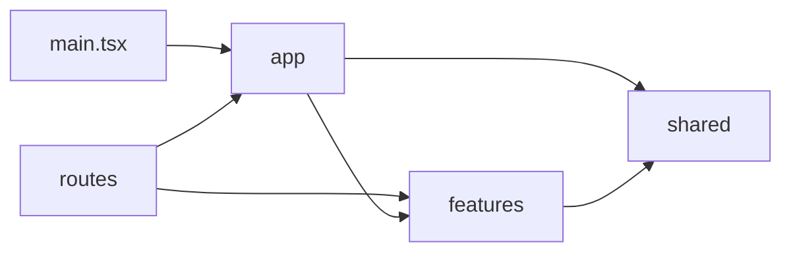
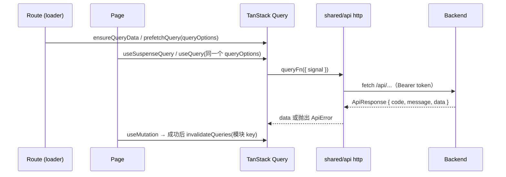
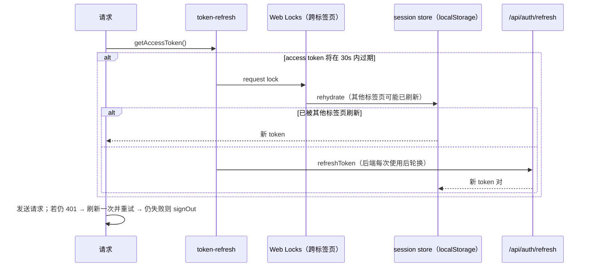

# 前端架构

## 1. 分层

```
src/
├── main.tsx            组合根：创建 QueryClient / Router，接线认证，挂载应用（唯一允许有导入副作用的模块）
├── app/                应用外壳：Providers、路由器、QueryClient、布局、菜单、跨模块接线
├── routes/             TanStack 文件路由（只做路由层面的事：守卫、search 校验、loader）
├── features/<name>/    业务模块，按后端业务模块划分（auth、model-configs、reviews…）
├── shared/             与业务无关的基础设施：http 客户端、通用组件、工具函数
├── test/               测试工具（setup、render helper、响应构造）
└── routeTree.gen.ts    生成文件，勿手改（入库，便于 tsc 与 CI）
```

依赖方向只能自上而下，由 Oxlint 的 `no-restricted-imports` 强制：



| 规则                                 | 说明                                                                   |
| ------------------------------------ | ---------------------------------------------------------------------- |
| `shared` 不能依赖 `features` / `app` | 保持基础设施与业务无关；需要业务能力时用注入（如 `configureHttpAuth`） |
| `features` 不能依赖 `app`            | 功能模块不知道自己被放在哪个外壳里                                     |
| 跨模块只能经由公共 API 导入          | `@/features/x`、`@/shared/x`，禁止深层路径；模块内部使用相对路径       |
| 任何模块都不能导入 `routes`          | 路由是依赖图的叶子；页面需要路由信息时用 `getRouteApi(routeId)`        |

### 功能模块内部结构

```
features/reviews/
├── index.ts         公共 API（其他模块只能从这里导入）
├── types.ts         与后端 DTO 一一对应的类型（注释标明对应的 Java 类）
├── api.ts           调用后端接口的纯函数，只依赖 shared/api 的 http
├── queries.ts       query key 工厂、queryOptions、mutation hooks
├── constants.ts     枚举的展示文案、业务常量
├── search.ts        路由 search 参数的 zod schema（如有）
├── components/      模块内组件：只通过 props 通信，不感知路由
└── pages/           路由页面：可通过 getRouteApi 读取 params / search
```

文件按需创建，不需要的不建。

## 2. 状态归属

每份状态只有一个权威来源：

| 状态类型                  | 归属                        | 例子                   |
| ------------------------- | --------------------------- | ---------------------- |
| 服务端数据                | TanStack Query 缓存         | 模型配置列表、评审任务 |
| 可分享 / 可回退的视图状态 | URL search 参数（zod 校验） | 分页、筛选条件         |
| 表单编辑中的值            | ProForm / antd Form         | 新建模型配置弹窗       |
| 跨页面的客户端状态        | Zustand store               | 登录会话               |
| 组件局部 UI 状态          | `useState`                  | 展开 / 收起            |

**不要**把服务端数据复制进 Zustand 或 `useState`；**不要**使用 ProTable 的 `request` 属性（它自带一套缓存，会与 Query 形成两个数据源）。ProTable 一律以受控方式使用：`dataSource` + `loading` + 受控 `pagination`。

## 3. 数据流



两种 loader 模式（选择依据见 [conventions.md](conventions.md#数据获取)）：

- **阻塞式**（详情页、小列表）：loader `ensureQueryData`，页面 `useSuspenseQuery`，首屏即有数据，失败进入路由错误边界。示例：`model-configs`。
- **非阻塞式**（分页 / 筛选表格）：loader 只 `prefetchQuery` 不等待，页面 `useQuery` + `keepPreviousData`，翻页不阻塞导航。示例：`reviews`。

## 4. HTTP 层与后端契约

`shared/api/http.ts` 是调用后端的唯一入口：

- 拼接 `VITE_API_BASE_URL`（默认 `/api`，生产环境同源部署，无需 CORS）。
- 解包后端统一响应 `ApiResponse { code, message, data }`，`code !== "OK"` 或非 2xx 时抛出 `ApiError(status, code, message)`。
- 无 JSON 响应体的错误（Spring Security 的 401/403、网关 5xx）按状态码给出中文提示；网络失败为 `NETWORK_ERROR`；请求取消（AbortError）原样抛出，交给 Query 处理。
- 认证通过注入的 `AuthAdapter` 实现，`shared` 因此不依赖 `features/auth`。

DTO 类型目前手写在各模块的 `types.ts`，并注明对应的 Java 记录类。后端接入 OpenAPI（springdoc）后，应改为由 `openapi-typescript` 生成，见第 8 节。

## 5. 认证



要点：

- **会话**（`features/auth/session-store.ts`）：Zustand + `persist`，存在 localStorage，同步水合，路由守卫可直接读取；`storage` 事件让多个标签页之间保持同步。
- **刷新**（`token-refresh.ts`）：后端的 refresh token **一次性使用并轮换**，并发刷新会让其中一个失败、把用户踢下线。因此同一标签页内共享一个进行中的 Promise，跨标签页用 Web Locks 串行化，拿到锁后重新读取会话。
- **主动 + 被动**：过期前 30 秒主动刷新；收到 401 时再被动刷新一次并重试。
- **退出**：会话中的用户消失（主动退出、refresh 失效、其他标签页退出或切换账号）时，`app/setup-auth.ts` 清空 Query 缓存并 `router.invalidate()`，路由守卫随即重定向到 `/login?redirect=…`。
- **重定向安全**：`sanitizeRedirect` 只接受站内绝对路径，防止开放重定向。
- **用户信息**：从 access token 的 claims（`sub`、`username`）解码，**仅用于展示**，不做任何权限判断。

## 6. 错误处理与反馈

| 场景             | 处理位置                                                    | 表现                                           |
| ---------------- | ----------------------------------------------------------- | ---------------------------------------------- |
| 查询首次加载失败 | 路由错误边界 `RouteError`（Suspense 查询或 `throwOnError`） | 整页 Result + 重试                             |
| 查询后台刷新失败 | `QueryCache.onError`                                        | toast，旧数据继续展示                          |
| mutation 失败    | `MutationCache.onError`                                     | toast 后端返回的 message；`meta.silent` 可关闭 |
| mutation 成功    | `MutationCache.onSuccess`                                   | `meta.successMessage` 存在时 toast             |
| 会话失效         | `ApiError.isSessionExpired`                                 | 不 toast，直接跳转登录页                       |
| 未匹配的路由     | `defaultNotFoundComponent`                                  | 404 Result                                     |

组件外的代码（Query 回调）通过 `shared/feedback` 获取与 `ConfigProvider` 上下文绑定的 `message` / `notification` / `modal`；组件内用 `App.useApp()`。

## 7. 构建与代码分割

- 路由启用 `autoCodeSplitting`，每个路由的组件是独立 chunk。
- `package.json` 声明 `"sideEffects": ["*.css"]`，打包器才能对功能模块的 barrel（`index.ts`）做 tree-shaking。否则路由文件为了 loader 导入 `queries` 时，会把整个页面连同 ProTable 一起拖进首屏 chunk。
  **因此除 `main.tsx` 外，任何模块都不得在顶层执行副作用**（注册、全局配置、修改 window 等），需要时导出函数，由 `main.tsx` 或 `app/` 显式调用。
- Router / Query Devtools 只在开发环境渲染，不进入生产包。

## 8. 已知的后端改进点

前端已按现状适配，下列改进能消除前端的变通代码：

1. **接入 OpenAPI（springdoc）**：DTO 类型改为生成，消除手写类型与后端漂移的风险。
2. **`POST /api/auth/logout` 改为 permitAll**：refresh token 本身就是凭证。目前它要求 access token，前端只能先确保 token 新鲜再读取 refresh token，以免刷新轮换后注销了一个已作废的 token。
3. **新增 `GET /api/auth/me`**：返回用户资料 / 角色，替代前端解码 JWT。
4. **时间字段使用 `Instant` / `OffsetDateTime`**：目前 `LocalDateTime` 序列化不带时区，前端只能按浏览器本地时区解析。
5. **细粒度错误码**：目前 message 为英文、code 较粗（`BAD_REQUEST` 等），前端无法本地化提示。
6. **refresh token 放入 httpOnly Cookie**：降低 XSS 窃取风险（需要配合 CSRF 防护）。
7. **评审任务列表**：缺少按状态筛选，也不返回仓库名称（前端目前显示 `#仓库ID`）。
8. **ID 序列化**：当前为数据库自增 ID，安全；若改用雪花 ID 等超过 2^53 的值，必须序列化为字符串。
